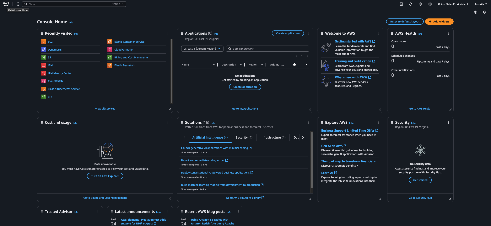
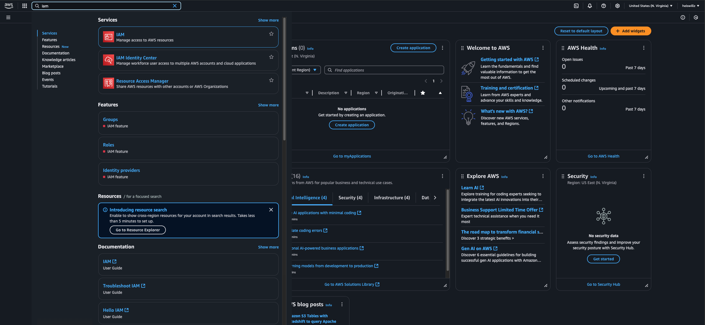

# MultiCloud, DevOps & AI Challenge - Day 1 - Experienced

<aside>
💡 Remember to use the class replay as a reference.
</aside>

## Streamlined Guide: Using Claude as AI Assistant to Terraform

### Step 1: Use Claude to Generate Terraform Code

1. Start a conversation with Claude.
2. Ask Claude to create Terraform code for an S3 bucket. Use a prompt like:
   > "Please provide Terraform code to create an S3 bucket in AWS with a unique name."
3. Claude should generate code similar to this:

```hcl
provider "aws" {
  region = "us-west-2"  # Replace with your desired region
}

resource "random_pet" "bucket_name" {
  length    = 2
  separator = "-"
}

resource "aws_s3_bucket" "example_bucket" {
  bucket = "my-unique-bucket-${random_pet.bucket_name.id}"

  # Enable versioning
  versioning {
    enabled = true
  }

  # Enable server-side encryption
  server_side_encryption_configuration {
    rule {
      apply_server_side_encryption_by_default {
        sse_algorithm = "AES256"
      }
    }
  }

  # Optional: Add tags
  tags = {
    Name        = "My Unique Bucket"
    Environment = "Development"
  }
}

# Optional: Block public access
resource "aws_s3_bucket_public_access_block" "bucket_access_block" {
  bucket = aws_s3_bucket.example_bucket.id

  block_public_acls   = true
  block_public_policy = true
  ignore_public_acls  = true
  restrict_public_buckets = true
}

output "bucket_name" {
  value = aws_s3_bucket.example_bucket.id
}
```

. Save this code for use in Step 5

### Step 1: Create IAM Role for EC2

1. Log in to the AWS Management Console.
   

2. Navigate to the IAM dashboard.
   
