# MultiCloud, DevOps & AI Challenge - Day 1 - Experienced

<aside>
💡 Remember to use the class replay as a reference.
</aside>

## Streamlined Guide: Using Claude as AI Assistant to Terraform

### Step 1: Use Claude to Generate Terraform Code

1. Start a conversation with Claude.
2. Ask Claude to create Terraform code for an S3 bucket. Use a prompt like:
   > "Please provide Terraform code to create an S3 bucket in AWS with a unique name."
3. Claude should generate code similar to this:

```hcl
provider "aws" {
  region = "us-west-2"  # Replace with your desired region
}

resource "random_pet" "bucket_name" {
  length    = 2
  separator = "-"
}

resource "aws_s3_bucket" "example_bucket" {
  bucket = "my-unique-bucket-${random_pet.bucket_name.id}"

  # Enable versioning
  versioning {
    enabled = true
  }

  # Enable server-side encryption
  server_side_encryption_configuration {
    rule {
      apply_server_side_encryption_by_default {
        sse_algorithm = "AES256"
      }
    }
  }

  # Optional: Add tags
  tags = {
    Name        = "My Unique Bucket"
    Environment = "Development"
  }
}

# Optional: Block public access
resource "aws_s3_bucket_public_access_block" "bucket_access_block" {
  bucket = aws_s3_bucket.example_bucket.id

  block_public_acls   = true
  block_public_policy = true
  ignore_public_acls  = true
  restrict_public_buckets = true
}

output "bucket_name" {
  value = aws_s3_bucket.example_bucket.id
}
```

. Save this code for use in Step 5

### Step 2: Create IAM Role for EC2

1. Log in to the AWS Management Console.
   

2. Navigate to the IAM dashboard.
   

3. Click "Roles" in the left sidebar, then "Create role".
   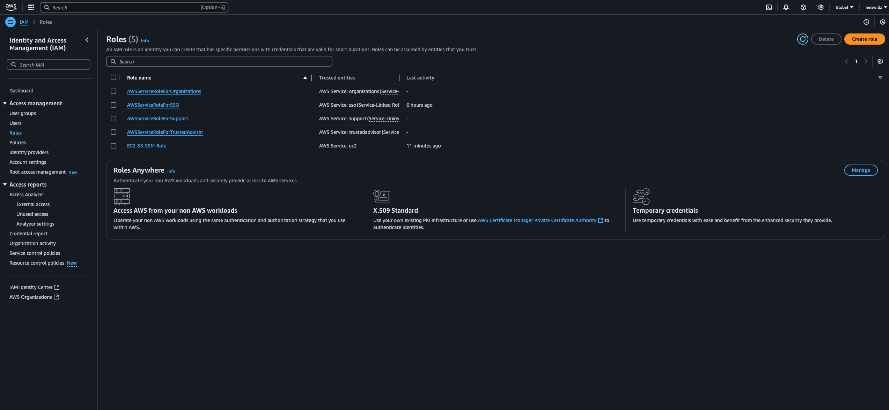

4. Choose "AWS service" as the trusted entity type and "EC2" as the use case.
   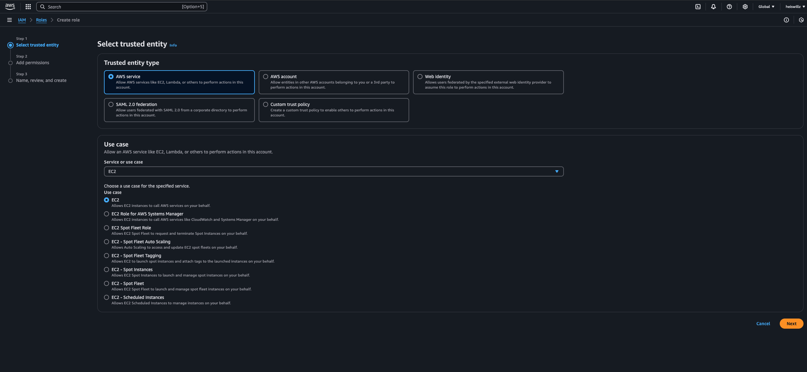

5. Search for and attach the "AdministratorAccess" policy
   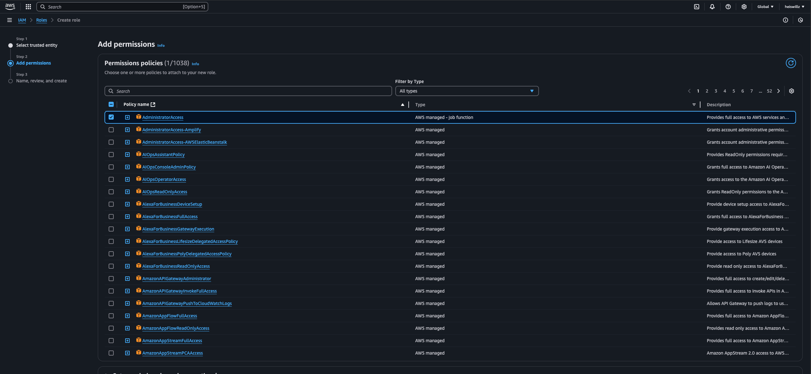
   Note: In a production environment, use a more restricted policy.

6. Name the role "EC2Admin" and provide a description.
   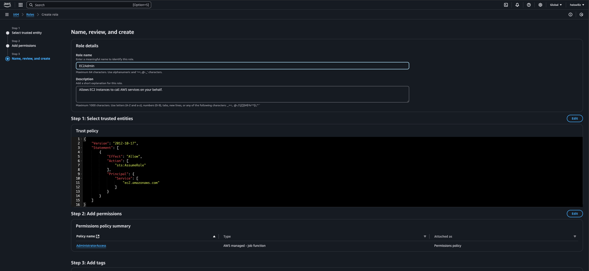
   Review and create the role.

### Step 3: Launch EC2 Instance

1. Go to the EC2 dashboard in the AWS Management Console.

2. Click "Launch Instance".
   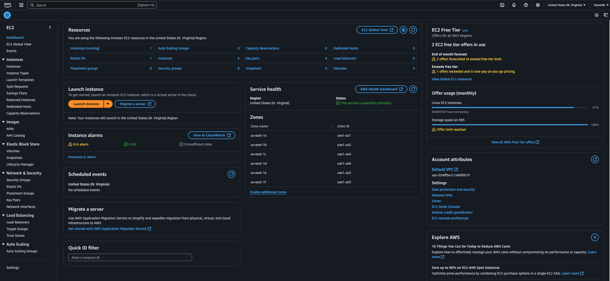

3. Choose an Amazon Linux 2 AMI.
   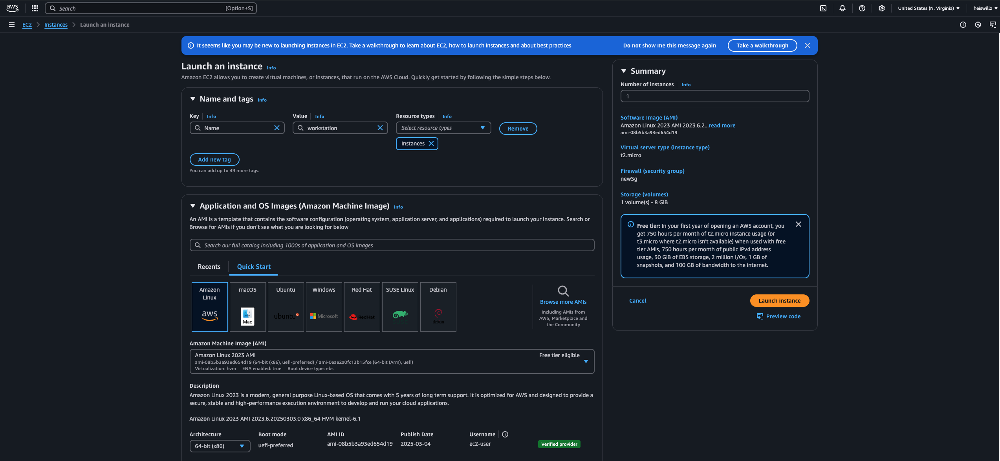

4. Select a t2.micro instance type.
   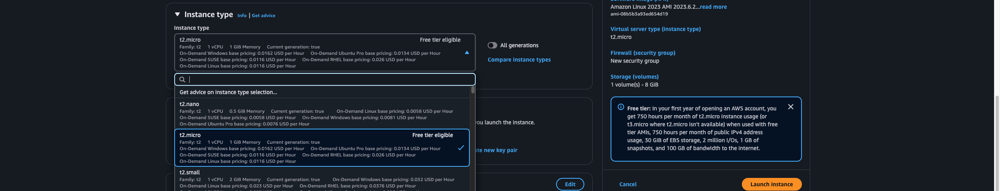

5. Configure instance details:

   - Network: Default VPC
   - Subnet: Any available
   - Auto-assign Public IP: Enable
   - IAM role: Select "EC2Admin"
     

     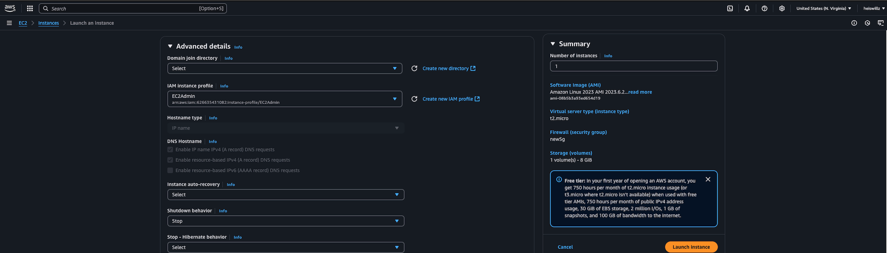

6. Keep default storage settings.

7. Add a tag: Key="Name", Value="workstation".
   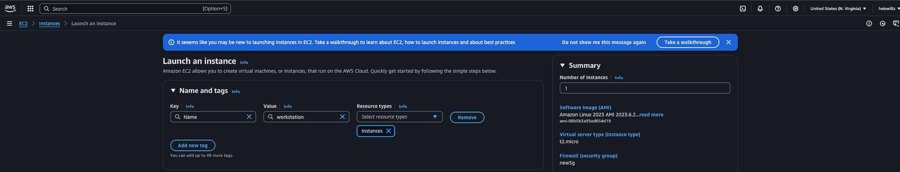

8. Create a security group allowing SSH access from EC2 Connect IP.
   

9. Review and launch, selecting or creating a key pair.
   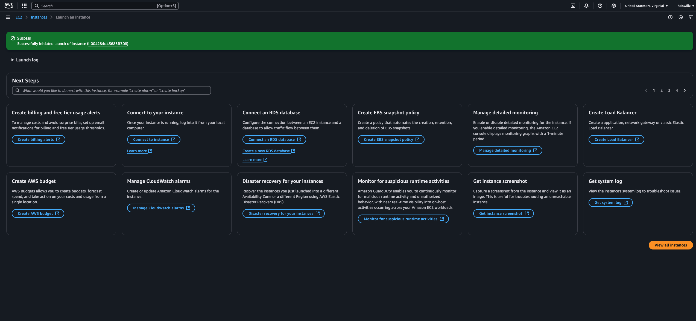

### Step 4: Connect to EC2 Instance and Install Terraform

1. From the EC2 dashboard, select your "workstation" instance.
   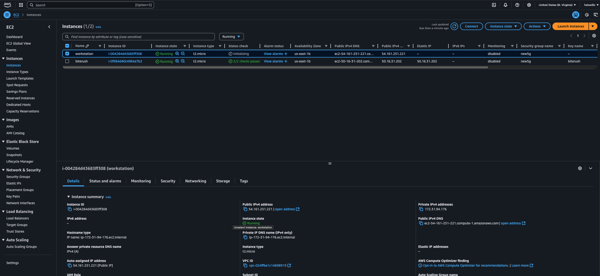

2. Click "Connect" and use the "EC2 Instance Connect" method.
   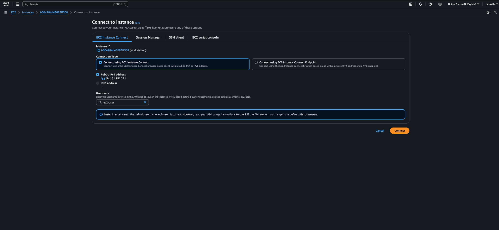

   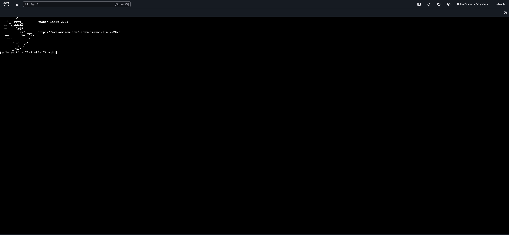

3. In the browser-based SSH session, update system packages:

   ```hcl
   sudo yum update -y
   ```

4. Install yum-utils:

   ```hcl
   sudo yum install -y yum-utils
   ```

   

   ```

   ```

5. Add HashiCorp repository:

   ```hcl
   sudo yum-config-manager --add-repo https://rpm.releases.hashicorp.com/AmazonLinux/hashicorp.repo
   ```

6. Install Terraform:

   ```hcl
   sudo yum -y install terraform
   ```

   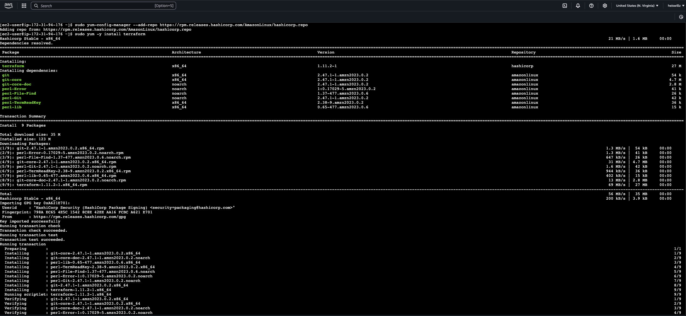

7. Verify installation:
   ```hcl
   terraform version
   ```
   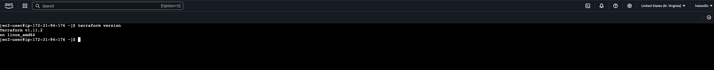

### Step 5: Connect to EC2 Instance and Install Terraform

1. Create a new directory and navigate to it:

   ```hcl
   mkdir terraform-project && cd terraform-project
   ```

   

2. Create and open main.tf:

   ```hcl
   nano main.tf
   ```

3. Paste the Terraform code generated by Claude in Step 1.

4. Save and exit the editor (in nano, press Ctrl+X, then Y, then Enter).
   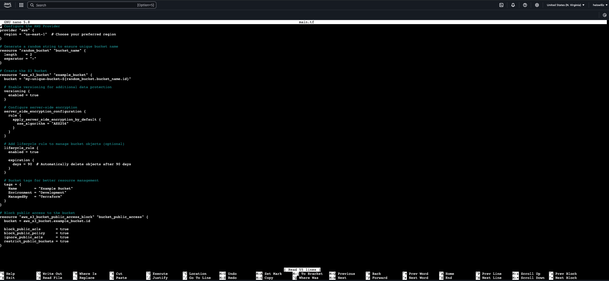

5. Initialize Terraform:

   ```hcl
   terraform init
   ```

   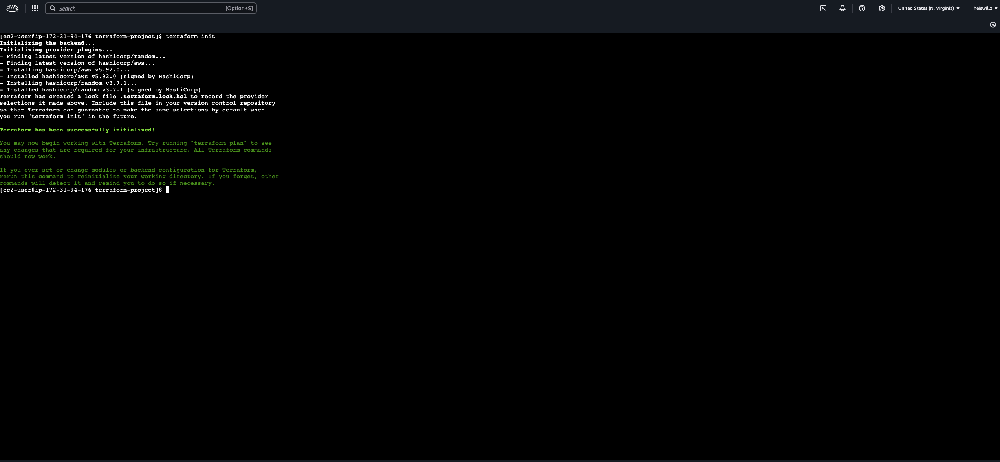

6. Review the plan:

   ```hcl
   terraform plan
   ```

   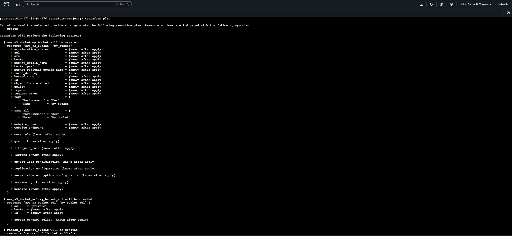

7. Apply the configuration:

   ```hcl
   terraform apply
   ```

8. Type "yes" when prompted to create the resources.
   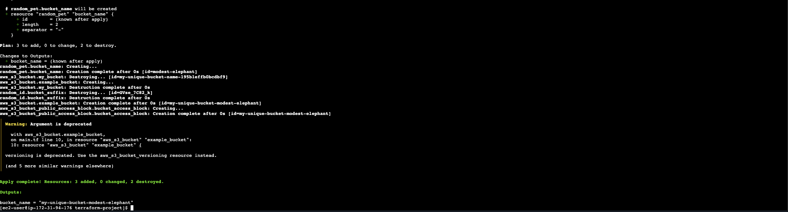
