# MultiCloud, DevOps & AI Challenge - Day 2

## Part 1 - Docker

### Step 1: Install Docker on EC2

Execute the following commands:

```hcl
sudo yum update -y
sudo yum install docker -y
sudo systemctl start docker
sudo docker run hello-world
sudo systemctl enable docker
docker --version
sudo usermod -a -G docker $(whoami)
newgrp docker
```

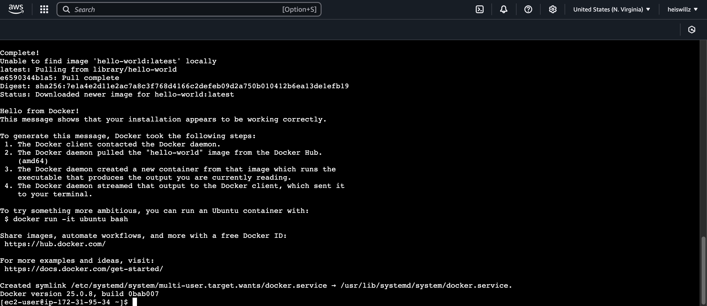

### Step 2: Create Docker image for CloudMart

### Backend

1. Create folder and download source code:

```hcl
mkdir -p challenge-day2/backend && cd challenge-day2/backend
wget https://tcb-public-events.s3.amazonaws.com/mdac/resources/day2/cloudmart-backend.zip
unzip cloudmart-backend.zip
```

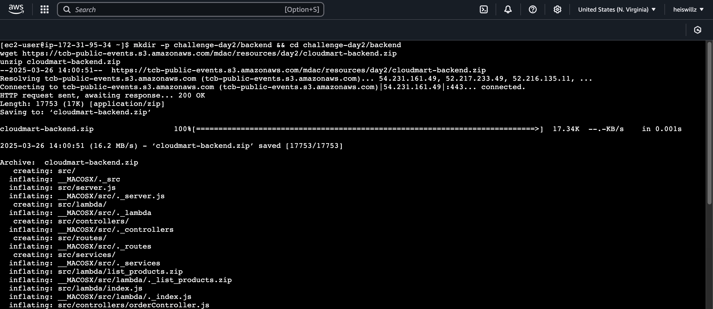

2. Create .env file:

```hcl
nano .env
```

Content of .env:

```hcl
PORT=5000
AWS_REGION=us-east-1
BEDROCK_AGENT_ID=<your-bedrock-agent-id>
BEDROCK_AGENT_ALIAS_ID=<your-bedrock-agent-alias-id>
OPENAI_API_KEY=<your-openai-api-key>
OPENAI_ASSISTANT_ID=<your-openai-assistant-id>
```

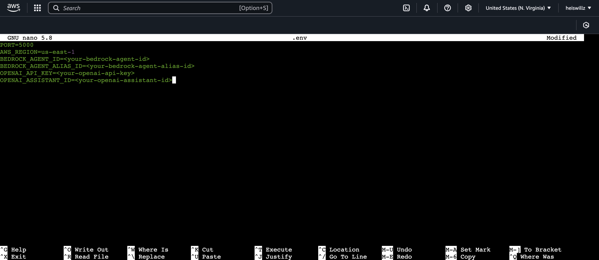

3. Create Dockerfile:

```hcl
nano Dockerfile
```

Content of Dockerfile:

```hcl
FROM node:18
WORKDIR /usr/src/app
COPY package*.json ./
RUN npm install
COPY . .
EXPOSE 5000
CMD ["npm", "start"]
```

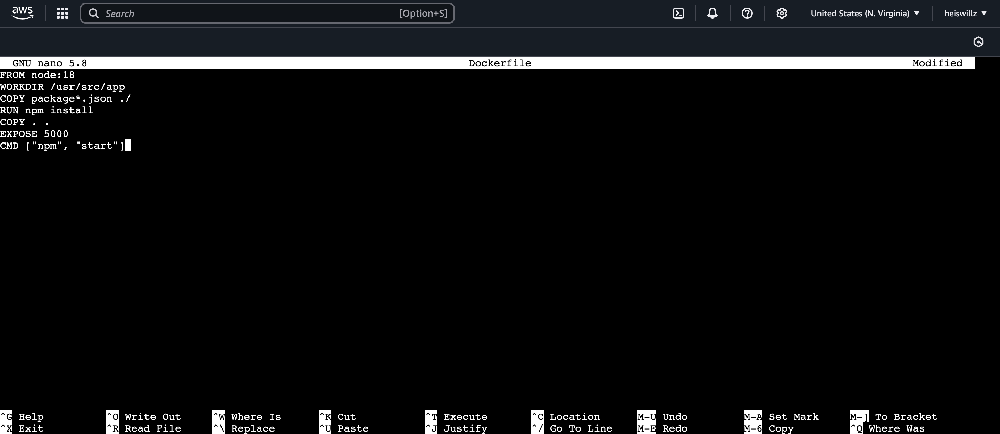

### Frontend

1. Create folder and download source code:

```hcl
cd ..
mkdir frontend && cd frontend
wget https://tcb-public-events.s3.amazonaws.com/mdac/resources/day2/cloudmart-frontend.zip
unzip cloudmart-frontend.zip
```

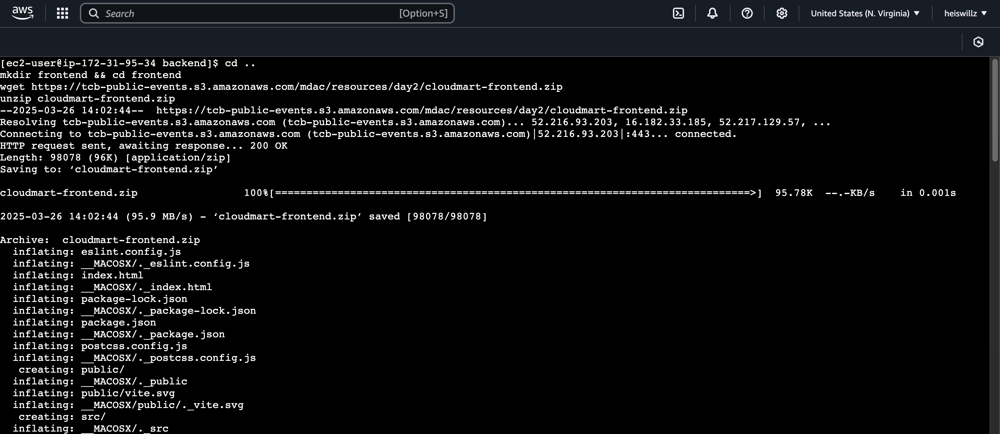

2. Create Dockerfile:

```hcl
nano Dockerfile
```

Content of Dockerfile:

```hcl
FROM node:16-alpine as build
WORKDIR /app
COPY package*.json ./
RUN npm ci
COPY . .
RUN npm run build

FROM node:16-alpine
WORKDIR /app
RUN npm install -g serve
COPY --from=build /app/dist /app
ENV PORT=5001
ENV NODE_ENV=production
EXPOSE 5001
CMD ["serve", "-s", ".", "-l", "5001"]
```

## Part 2 - Kubernetes

Attention: AWS Kubernetes service is not free, so when executing the hands-on below, you will be charged a few cents on your AWS account according to EKS pricing on AWS.

Remember to delete the cluster to avoid unwanted charges. Use the removal section at the end of the doc.

### Cluster Setup on AWS Elastic Kubernetes Services (EKS)

1. Create a user named eksuser with Admin privileges and authenticate with it

```hcl
aws configure
```

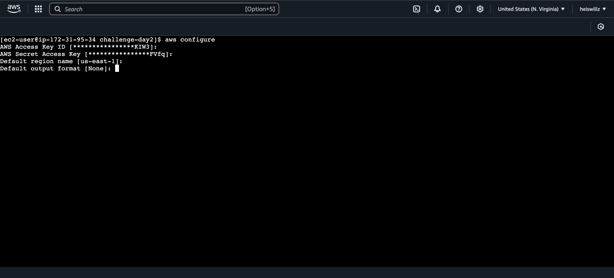

2.Install the CLI tool eksctl

```hcl
curl --silent --location "https://github.com/weaveworks/eksctl/releases/latest/download/eksctl_$(uname -s)_amd64.tar.gz" | tar xz -C /tmp
sudo cp /tmp/eksctl /usr/bin
eksctl version
```

3. Install the CLI tool kubectl

```hcl
curl -o kubectl https://amazon-eks.s3.us-west-2.amazonaws.com/1.18.9/2020-11-02/bin/linux/amd64/kubectl
chmod +x ./kubectl
mkdir -p $HOME/bin && cp ./kubectl $HOME/bin/kubectl && export PATH=$PATH:$HOME/bin
echo 'export PATH=$PATH:$HOME/bin' >> ~/.bashrc
kubectl version --short --client
```

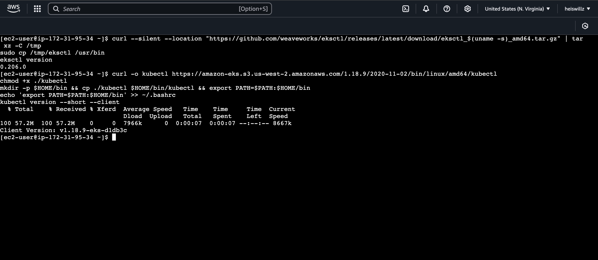

4. Create an EKS Cluster

```hcl
eksctl create cluster \
  --name cloudmart \
  --region us-east-1 \
  --nodegroup-name standard-workers \
  --node-type t3.medium \
  --nodes 1 \
  --with-oidc \
  --managed
```

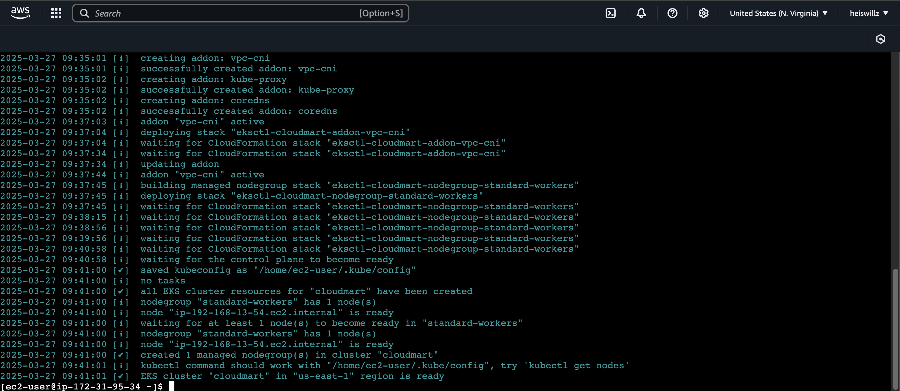

5. Connect to the EKS cluster using the kubectl configuration

```hcl
aws eks update-kubeconfig --name cloudmart
```

6. Verify Cluster Connectivity

```hcl
kubectl get svc
kubectl get nodes
```

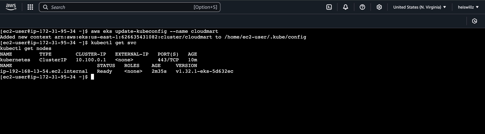

7. Create a Role & Service Account to provide pods access to services used by the application (DynamoDB, Bedrock, etc).

```hcl
eksctl create iamserviceaccount \
  --cluster=cloudmart \
  --name=cloudmart-pod-execution-role \
  --role-name CloudMartPodExecutionRole \
  --attach-policy-arn=arn:aws:iam::aws:policy/AdministratorAccess\
  --region us-east-1 \
  --approve
```

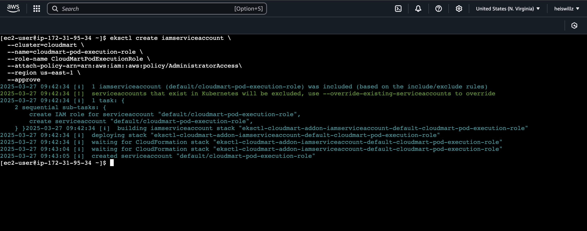

NOTE: In the example above, Admin privileges were used to facilitate educational purposes. Always remember to follow the principle of least privilege in production environments

## Backend Deployment on Kubernetes

1. Create an ECR Repository for the Backend and upload the Docker image to it

```hcl
Repository name: cloudmart-backend
```

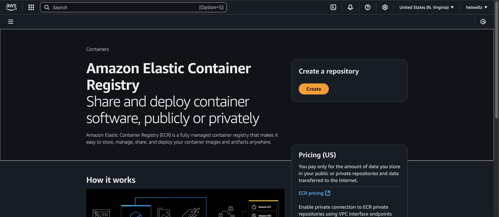
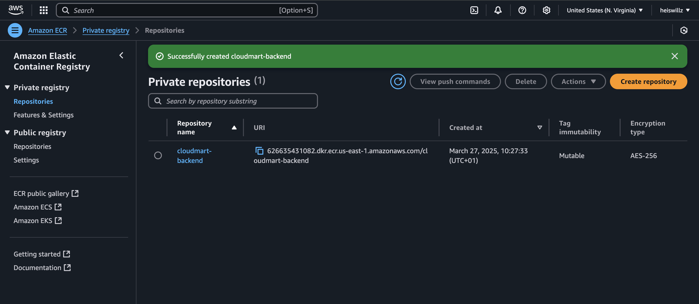

2. Switch to backend folder

```hcl
cd ../..
cd challenge-day2/backend
```

3. Follow the ECR steps to build your Docker image
   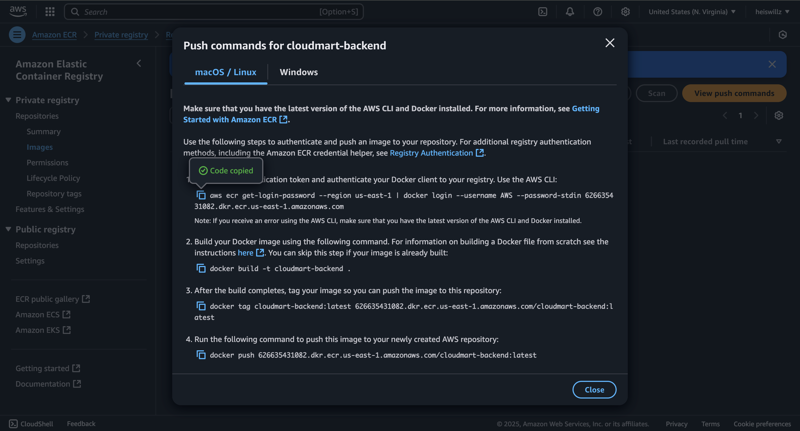

4. Create a Kubernetes deployment file (YAML) for the Backend

```hcl
cd ../..
cd challenge-day2/backend
nano cloudmart-backend.yaml
```

```hcl
apiVersion: apps/v1
kind: Deployment
metadata:
  name: cloudmart-backend-app
spec:
  replicas: 1
  selector:
    matchLabels:
      app: cloudmart-backend-app
  template:
    metadata:
      labels:
        app: cloudmart-backend-app
    spec:
      serviceAccountName: cloudmart-pod-execution-role
      containers:
      - name: cloudmart-backend-app
        image: public.ecr.aws/l4c0j8h9/cloudmart-backend:latest
        env:
        - name: PORT
          value: "5000"
        - name: AWS_REGION
          value: "us-east-1"
        - name: BEDROCK_AGENT_ID
          value: "xxxxxx"
        - name: BEDROCK_AGENT_ALIAS_ID
          value: "xxxx"
        - name: OPENAI_API_KEY
          value: "xxxxxx"
        - name: OPENAI_ASSISTANT_ID
          value: "xxxx"
---

apiVersion: v1
kind: Service
metadata:
  name: cloudmart-backend-app-service
spec:
  type: LoadBalancer
  selector:
    app: cloudmart-backend-app
  ports:
    - protocol: TCP
      port: 5000
      targetPort: 5000
```

Note: Replace image: public.ecr.aws/l4c0j8h9/cloudmart-backend:latest with image from ecr

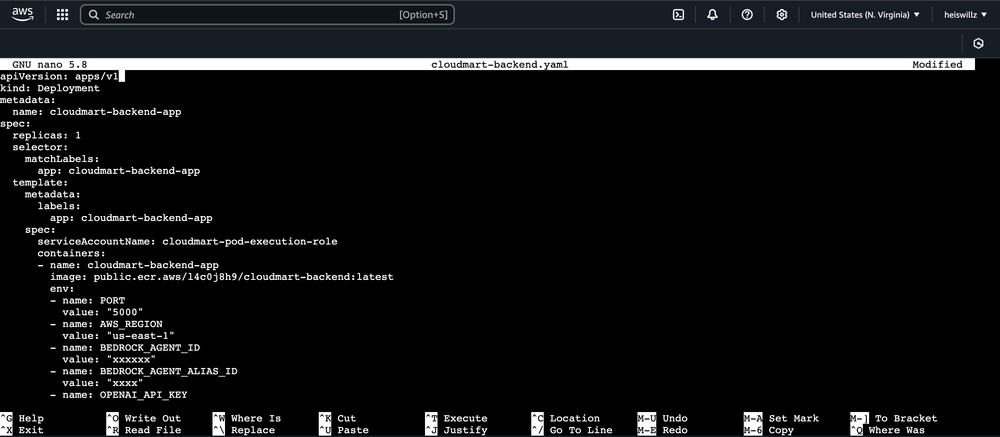

5. Deploy the Backend on Kubernetes

```hcl
kubectl apply -f cloudmart-backend.yaml
```

6. Monitor the status of objects being created and obtain the public IP generated for the API

```hcl
kubectl get pods
kubectl get deployment
kubectl get service
```

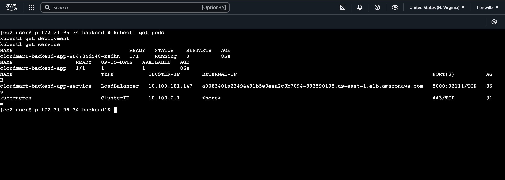

## Frontend Deployment on Kubernetes

1. Change the Frontend's .env file to point to the API URL created within Kubernetes obtained by the kubectl get service command

```hcl
cd ../challenge-day2/frontend
nano .env
```

Content of .env:

```hcl
VITE_API_BASE_URL=http://<your_url_kubernetes_api>:5000/api
```

2. Create an ECR Repository for the Frontend and upload the Docker image to it

```hcl
Repository name: cloudmart-frontend
```

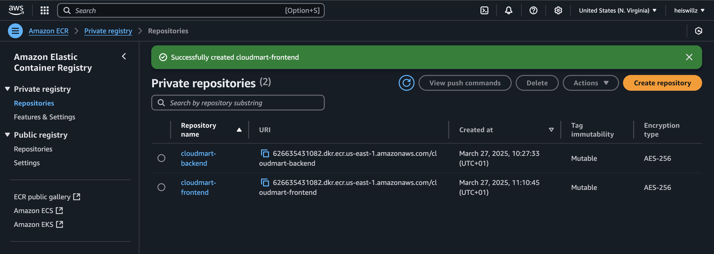

3. Follow the ECR steps to build your Docker image
   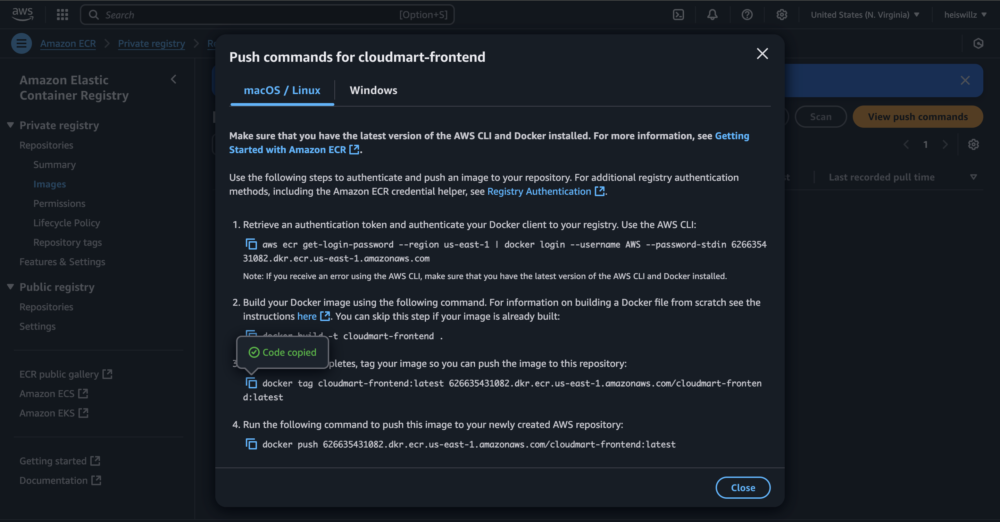

4. Create a Kubernetes deployment file (YAML) for the Frontend

```hcl
nano cloudmart-frontend.yaml
```

```hcl
apiVersion: apps/v1
kind: Deployment
metadata:
  name: cloudmart-frontend-app
spec:
  replicas: 1
  selector:
    matchLabels:
      app: cloudmart-frontend-app
  template:
    metadata:
      labels:
        app: cloudmart-frontend-app
    spec:
      serviceAccountName: cloudmart-pod-execution-role
      containers:
      - name: cloudmart-frontend-app
        image: public.ecr.aws/l4c0j8h9/cloudmart-frontend:latest
---

apiVersion: v1
kind: Service
metadata:
  name: cloudmart-frontend-app-service
spec:
  type: LoadBalancer
  selector:
    app: cloudmart-frontend-app
  ports:
    - protocol: TCP
      port: 5001
      targetPort: 5001
```

Note: Replace image: public.ecr.aws/l4c0j8h9/cloudmart-backend:latest with image from ecr

5. Deploy the Frontend on Kubernetes

```hcl
kubectl apply -f cloudmart-frontend.yaml
```

6. Monitor the status of objects being created and obtain the public IP generated for the API

```hcl
kubectl get pods
kubectl get deployment
kubectl get service
```

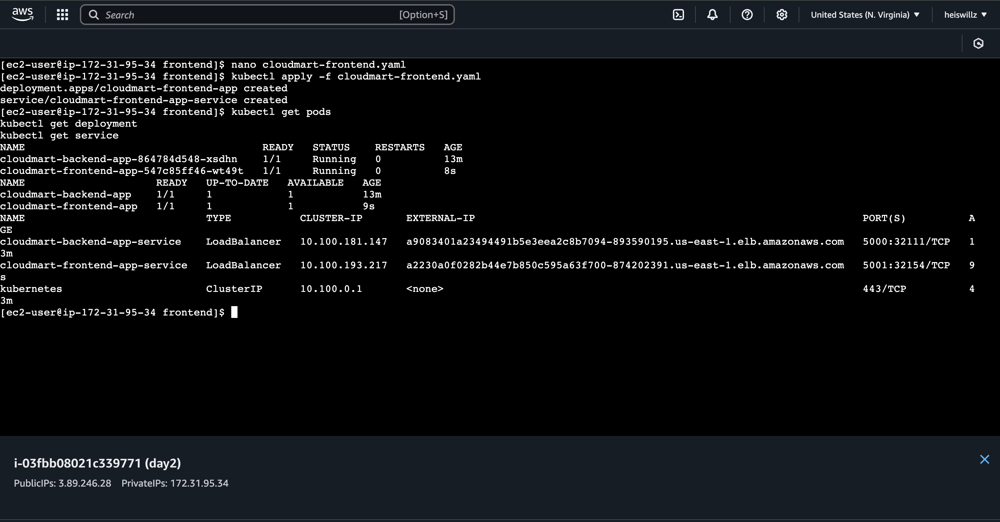

Check the Loadbalancer on the AWS Page and access our application

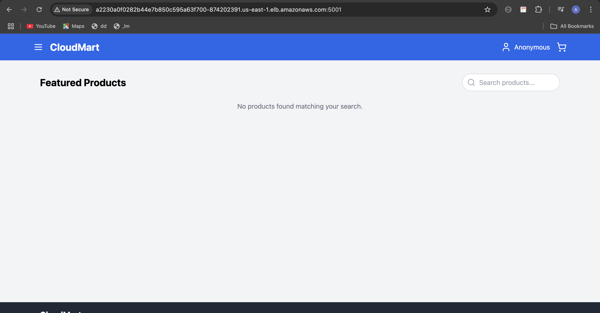
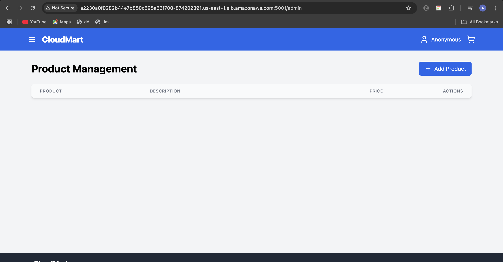
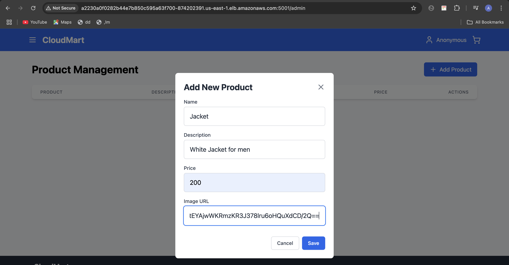
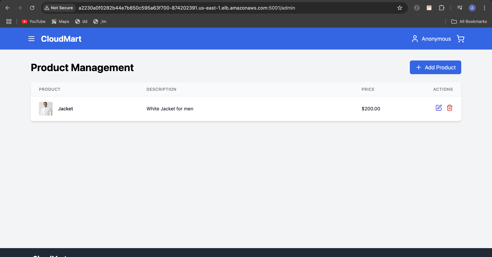
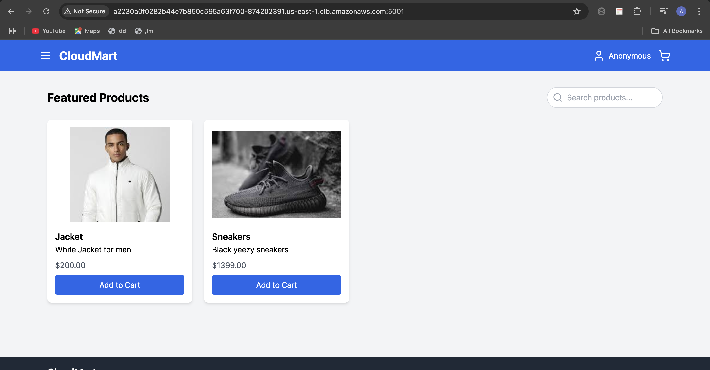

## Removal

At the end of the hands-on, delete all resources:

If you delete the cluster at the end of the exercise, you'll have to recreate it for the next days. So decide what makes more sense for you: delete the cluster and recreate it every day or keep it and pay for the time it's running. However, don't forget to delete it permanently at the end of the Challenge.

```hcl
kubectl delete service cloudmart-frontend-app-service
kubectl delete deployment cloudmart-frontend-app
kubectl delete service cloudmart-backend-app-service
kubectl delete deployment cloudmart-backend-app

eksctl delete cluster --name cloudmart --region us-east-1
```
