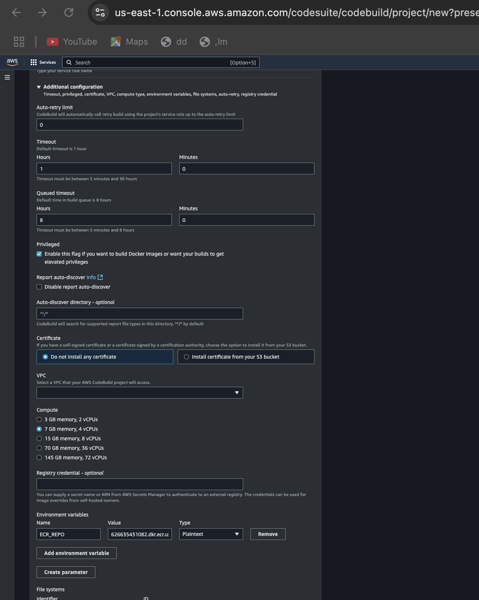

# MultiCloud, DevOps & AI Challenge - Day 3

### Part 1: CI/CD Pipeline Configuration

1. Create a free account on GitHub and then create a new repository on GitHub called cloudmart

```hcl
cd challenge-day2/frontend
<Run GitHub steps>
```


2. Start by pushing the changes in the CloudMart application source code to GitHub

```hcl
git status
git add -A
git commit -m "app sent to repo"
git push
```


3. Configure AWS CodePipeline

Create a New Pipeline:
Access AWS CodePipeline.
Start the 'Create pipeline' process.
Name: `cloudmart-cicd-pipeline`
Use the GitHub repository `cloudmart-application` as the source.
Add the 'cloudmartBuild' project as the build stage.
Add the 'cloudmartDeploy' project as the deployment stage.


4. Configure AWS CodeBuild to Build the Docker Image

Create a Build Project:
Give the project a name (for example, cloudmartBuild).
Connect it to your existing GitHub repository (**`cloudmart-application`**).
**Image: amazonlinux2-x86_64-standard:4.0**
Configure the environment to support Docker builds. Enable "Enable this flag if you want to build Docker images or want your builds to get elevated privileges"
Add the environment variable **ECR_REPO** with the ECR repository URI.
For the build specification, use the following **`buildspec.yml`**:

```hcl
version: 0.2
phases:
  install:
    runtime-versions:
      docker: 20
  pre_build:
    commands:
      - echo Logging in to Amazon ECR...
      - aws --version
      - REPOSITORY_URI=$ECR_REPO
      - aws ecr-public get-login-password --region us-east-1 | docker login --username AWS --password-stdin public.ecr.aws/l4c0j8h9
  build:
    commands:
      - echo Build started on `date`
      - echo Building the Docker image...
      - docker build -t $REPOSITORY_URI:latest .
      - docker tag $REPOSITORY_URI:latest $REPOSITORY_URI:$CODEBUILD_RESOLVED_SOURCE_VERSION
  post_build:
    commands:
      - echo Build completed on `date`
      - echo Pushing the Docker image...
      - docker push $REPOSITORY_URI:latest
      - docker push $REPOSITORY_URI:$CODEBUILD_RESOLVED_SOURCE_VERSION
      - export imageTag=$CODEBUILD_RESOLVED_SOURCE_VERSION
      - printf '[{\"name\":\"cloudmart-app\",\"imageUri\":\"%s\"}]' $REPOSITORY_URI:$imageTag > imagedefinitions.json
      - cat imagedefinitions.json
      - ls -l

env:
  exported-variables: ["imageTag"]

artifacts:
  files:
    - imagedefinitions.json
    - cloudmart-frontend.yaml
```

Note: replace aws ecr-public get-login-password --region us-east-1 | docker login --username AWS --password-stdin public.ecr.aws/l4c0j8h9 with Information gotten from the push command

 


5.Add the AmazonElasticContainerRegistryPublicFullAccess permission to ECR in the service role
Access the IAM console > Roles.
Look for the role created "cloudmartBuild" for CodeBuild.
Add the permission AmazonElasticContainerRegistryPublicFullAccess.


6. Configure AWS CodeBuild for Application Deployment
   Create a Deployment Project:
   Repeat the process of creating projects in CodeBuild.
   Give this project a different name (for example, cloudmartDeployToProduction).
   Configure the environment variables AWS_ACCESS_KEY_ID and AWS_SECRET_ACCESS_KEY for the credentials of the user eks-user in Cloud Build, so it can authenticate to the Kubernetes cluster.

Note: in a real-world production environment, it is recommended to use an IAM role for this purpose. In this practical exercise, we are directly using the credentials of the eks-user to facilitate the process, since our focus is on CI/CD and not on user authentication at this moment. The configuration of this process in EKS is more extensive. Refer to the Reference section and check "Enabling IAM principal access to your cluster"
