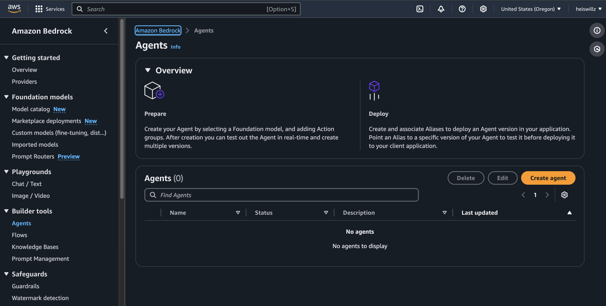

# MultiCloud, DevOps & AI Challenge - Day 4

## Creating resources using Terraform

Navigate to the folder containing the main.tf file and download the zip file containing the Lambda function that will be used by Bedrock

```hcl
cd challenge-day2/backend/src/lambda
cp list_products.zip ../../../../terraform-project/
cd ../../../../terraform-project
```

Add the following lines at the end of the main.tf file

```hcl
# IAM Role for Lambda function
resource "aws_iam_role" "lambda_role" {
  name = "cloudmart_lambda_role"

  assume_role_policy = jsonencode({
    Version = "2012-10-17"
    Statement = [
      {
        Action = "sts:AssumeRole"
        Effect = "Allow"
        Principal = {
          Service = "lambda.amazonaws.com"
        }
      }
    ]
  })
}

# IAM Policy for Lambda function
resource "aws_iam_role_policy" "lambda_policy" {
  name = "cloudmart_lambda_policy"
  role = aws_iam_role.lambda_role.id

  policy = jsonencode({
    Version = "2012-10-17"
    Statement = [
      {
        Effect = "Allow"
        Action = [
          "dynamodb:Scan",
          "logs:CreateLogGroup",
          "logs:CreateLogStream",
          "logs:PutLogEvents"
        ]
        Resource = [
          aws_dynamodb_table.cloudmart_products.arn,
          aws_dynamodb_table.cloudmart_orders.arn,
          aws_dynamodb_table.cloudmart_tickets.arn,
          "arn:aws:logs:*:*:*"
        ]
      }
    ]
  })
}

# Lambda function for listing products
resource "aws_lambda_function" "list_products" {
  filename         = "list_products.zip"
  function_name    = "cloudmart-list-products"
  role             = aws_iam_role.lambda_role.arn
  handler          = "index.handler"
  runtime          = "nodejs20.x"
  source_code_hash = filebase64sha256("list_products.zip")

  environment {
    variables = {
      PRODUCTS_TABLE = aws_dynamodb_table.cloudmart_products.name
    }
  }
}

# Lambda permission for Bedrock
resource "aws_lambda_permission" "allow_bedrock" {
  statement_id  = "AllowBedrockInvoke"
  action        = "lambda:InvokeFunction"
  function_name = aws_lambda_function.list_products.function_name
  principal     = "bedrock.amazonaws.com"
}

# Output the ARN of the Lambda function
output "list_products_function_arn" {
  value = aws_lambda_function.list_products.arn
}
```


## Configuring the Amazon Bedrock Agent

Follow these steps to manually create the Bedrock Agent for CloudMart:
Model Access:

1. In the Amazon Bedrock console, go to "Model access" in the navigation panel.
2. Choose "Enable specific models".
3. Select the Claude 3 Sonnet model.
4. Wait until the model access status changes to "Access granted".


## Create the Agent:

1. In the Amazon Bedrock console, choose "Agents" under "Builder tools" in the navigation panel.
2. Click on "Create agent".
3. Name the agent "cloudmart-product-recommendation-agent".
4. Select "Claude 3 Sonnet" as the base model.
5. Paste the agent instructions below in the "Instructions for the Agent" section.

```hcl
You are a product recommendations agent for CloudMart, an online e-commerce store. Your role is to assist customers in finding products that best suit their needs. Follow these instructions carefully:

1. Begin each interaction by retrieving the full list of products from the API. This will inform you of the available products and their details.

2. Your goal is to help users find suitable products based on their requirements. Ask questions to understand their needs and preferences if they're not clear from the user's initial input.

3. Use the 'name' parameter to filter products when appropriate. Do not use or mention any other filter parameters that are not part of the API.

4. Always base your product suggestions solely on the information returned by the API. Never recommend or mention products that are not in the API response.

5. When suggesting products, provide the name, description, and price as returned by the API. Do not invent or modify any product details.

6. If the user's request doesn't match any available products, politely inform them that we don't currently have such products and offer alternatives from the available list.

7. Be conversational and friendly, but focus on helping the user find suitable products efficiently.

8. Do not mention the API, database, or any technical aspects of how you retrieve the information. Present yourself as a knowledgeable sales assistant.

9. If you're unsure about a product's availability or details, always check with the API rather than making assumptions.

10. If the user asks about product features or comparisons, use only the information provided in the product descriptions from the API.

11. Be prepared to assist with a wide range of product inquiries, as our e-commerce store may carry various types of items.

12. If a user is looking for a specific type of product, use the 'name' parameter to search for relevant items, but be aware that this may not capture all categories or types of products.

Remember, your primary goal is to help users find the best products for their needs from what's available in our store. Be helpful, informative, and always base your recommendations on the actual product data provided by the API.
```




## Configure the IAM Role:

1. In the Bedrock Agent overview, locate the 'Permissions' section.
2. Click on the IAM role link. This will take you to the IAM console with the correct role selected.
3. In the IAM console, choose "Add permissions" and then "Create inline policy".
4. In the JSON tab, paste the following policy:

```hcl
{
  "Version": "2012-10-17",
  "Statement": [
    {
      "Effect": "Allow",
      "Action": "lambda:InvokeFunction",
      "Resource": "arn:aws:lambda:*:*:function:cloudmart-list-products"
    },
    {
      "Effect": "Allow",
      "Action": "bedrock:InvokeModel",
      "Resource": "arn:aws:bedrock:*::foundation-model/anthropic.claude-3-sonnet-20240229-v1:0"
    }
  ]
}
```

Replace cloudmart-list-products with the actual name of your Lambda function, if different.
Name the policy (for example, "BedrockAgentLambdaAccess") and create it.
Verify that the new policy is attached to the role.


## Configure the Action Group:

1. In the "Action groups" section, create a new group called "Get-Product-Recommendations".
2. Set the action group type as "Define with API schemas".
3. Select the Lambda function "cloudmart-list-products" as the action group executor.
4. In the "Action group schema" section, choose "Define via in-line schema editor".
5. Paste the OpenAPI schema below into the schema editor.

```hcl

{
    "openapi": "3.0.0",
    "info": {
        "title": "Product Details API",
        "version": "1.0.0",
        "description": "This API retrieves product information. Filtering parameters are passed as query strings. If query strings are empty, it performs a full scan and retrieves the full product list."
    },
    "paths": {
        "/products": {
            "get": {
                "operationId": "getProductDetails",
                "summary": "Retrieve product details",
                "description": "Retrieves a list of products based on the provided query string parameters. If no parameters are provided, it returns the full list of products.",
                "parameters": [
                    {
                        "name": "name",
                        "in": "query",
                        "description": "Retrieve details for a specific product by name",
                        "schema": {
                            "type": "string"
                        }
                    }
                ],
                "responses": {
                    "200": {
                        "description": "Successful response",
                        "content": {
                            "application/json": {
                                "schema": {
                                    "type": "array",
                                    "items": {
                                        "type": "object",
                                        "properties": {
                                            "name": {
                                                "type": "string"
                                            },
                                            "description": {
                                                "type": "string"
                                            },
                                            "price": {
                                                "type": "number"
                                            }
                                        }
                                    }
                                }
                            }
                        }
                    },
                    "500": {
                        "description": "Internal Server Error",
                        "content": {
                            "application/json": {
                                "schema": {
                                    "$ref": "#/components/schemas/ErrorResponse"
                                }
                            }
                        }
                    }
                }
            }
        }
    },
    "components": {
        "schemas": {
            "ErrorResponse": {
                "type": "object",
                "properties": {
                    "error": {
                        "type": "string",
                        "description": "Error message"
                    }
                },
                "required": [
                    "error"
                ]
            }
        }
    }
}
```


## Review and Create:

1. Review all agent configurations.
2. Click on "Prepare agent" to finalize the creation.

## Test the Agent:

1. After creation, use the "Test Agent" panel to have conversations with the chatbot.
2. Verify if the agent is asking relevant questions about the recipient's gender, occasion, and desired category.
3. Confirm if the agent is consulting the API and presenting appropriate product recommendations.


## Create an Alias for the Agent:

1. On the agent details page, go to the "Aliases" section.
2. Click on "Create alias".
3. Name the alias "cloudmart-prod".
4. Select the most recent version of the agent.
5. Click on "Create alias" to finalize.

Note: Make sure that the Lambda function name in the IAM policy matches the actual name of your function and adjust the region in the ARNs if you're not using us-east-1.


# OpenAI Assistant Configuration

Follow these steps to create an OpenAI assistant for CloudMart:

## OpenAI Access:

1. Access the OpenAI platform (https://platform.openai.com/).
2. Log in or create an account if you don't have one yet.

## Create the Assistant:

1. Navigate to the "Assistants" section.
2. Click on "Create New Assistant".
3. Name the assistant "CloudMart Customer Support".
4. Select the model `gpt-4o`.

## Configure the Assistant:

1. In the "Instructions" section, paste the following:

   ```hcl
   You are a customer support agent for CloudMart, an e-commerce platform. Your role is to assist customers with general inquiries, order issues, and provide helpful information about using the CloudMart platform. You don't have direct access to specific product or inventory information. Always be polite, patient, and focus on providing excellent customer service. If a customer asks about specific products or inventory, politely explain that you don't have access to that information and suggest they check the website or speak with a sales representative.
   ```

2. In "Capabilities", you can enable "Code Interpreter" if you want the assistant to help with technical aspects of using the platform.

## Save the Assistant:

1. After creating the assistant it is going to auto-save.
2. Note down the Assistant ID, you'll need it for your environment variables.

## Generate API Key:

1. Go to the API Keys section in your OpenAI account.
2. Generate a new API key.
3. Copy this key, you'll need it for your environment variables.

# Redeploy the backend with AI Assistants

## Update the `cloudmart-backend.yaml` file with AI Assistants information

Open the `cloudmart-backend.yaml` file:

```hcl
nano cloudmart-backend.yaml
```

Content of cloudmart-backend.yaml:

```hcl
apiVersion: apps/v1
kind: Deployment
metadata:
  name: cloudmart-backend-app
spec:
  replicas: 1
  selector:
    matchLabels:
      app: cloudmart-backend-app
  template:
    metadata:
      labels:
        app: cloudmart-backend-app
    spec:
      serviceAccountName: cloudmart-pod-execution-role
      containers:
      - name: cloudmart-backend-app
        image: public.ecr.aws/l4c0j8h9/cloudmaster-backend:latest
        env:
        - name: PORT
          value: "5000"
        - name: AWS_REGION
          value: "us-east-1"
        - name: BEDROCK_AGENT_ID
          value: "xxxx"
        - name: BEDROCK_AGENT_ALIAS_ID
          value: "xxxx"
        - name: OPENAI_API_KEY
          value: "xxxx"
        - name: OPENAI_ASSISTANT_ID
          value: "xxxx"
---

apiVersion: v1
kind: Service
metadata:
  name: cloudmart-backend-app-service
spec:
  type: LoadBalancer
  selector:
    app: cloudmart-backend-app
  ports:
    - protocol: TCP
      port: 5000
      targetPort: 5000
```

Update the deployment in Kubernetes

```hcl
kubectl apply -f cloudmart-backend.yaml
```

Test the AI Assistant


